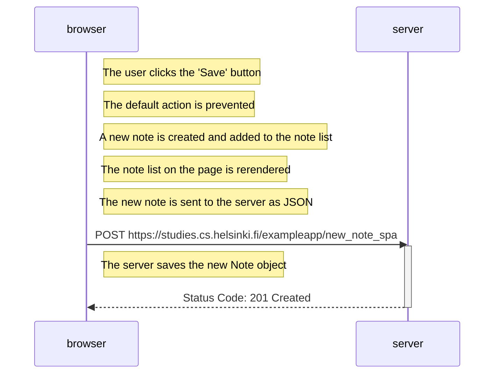

```mermaid
sequenceDiagram
    participant browser
    participant server

    Note right of browser: The user clicks the 'Save' button
    Note right of browser: The default action is prevented
    Note right of browser: A new note is created and added to the note list
    Note right of browser: The note list on the page is rerendered
    Note right of browser: The new note is sent to the server as JSON

    browser->>server: POST https://studies.cs.helsinki.fi/exampleapp/new_note_spa
    activate server
    Note right of browser: The server saves the new Note object 
    server-->>browser: Status Code: 201 Created
    deactivate server
```